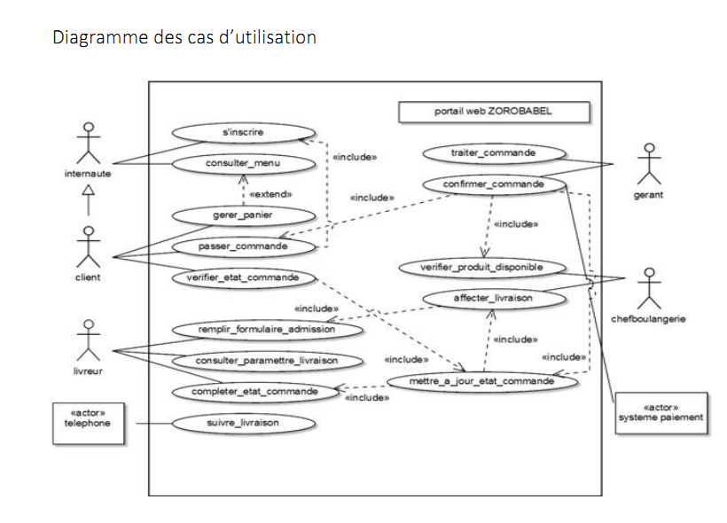
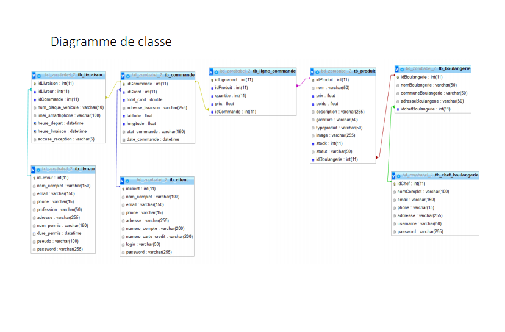
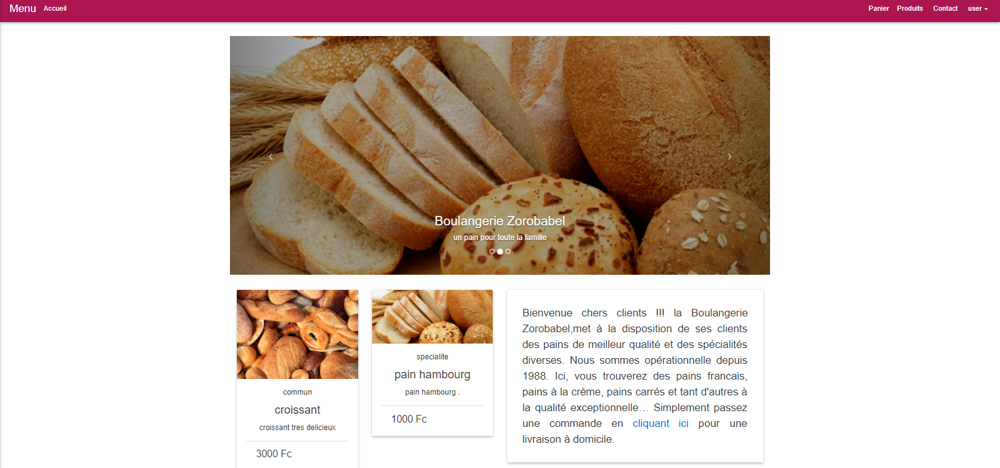
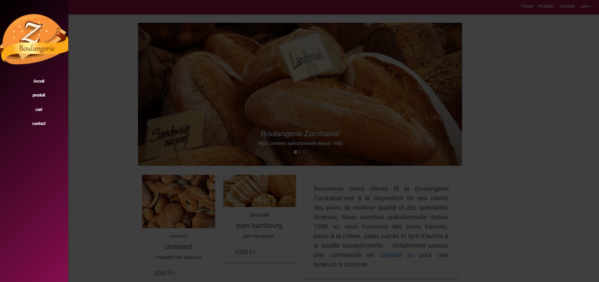
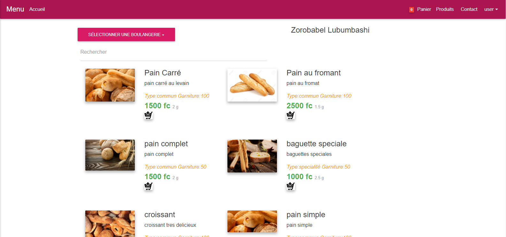
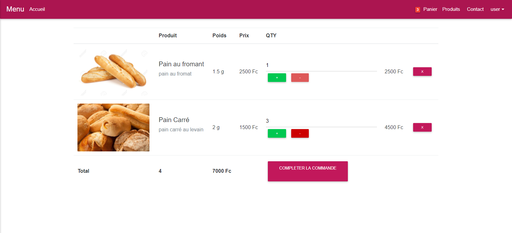
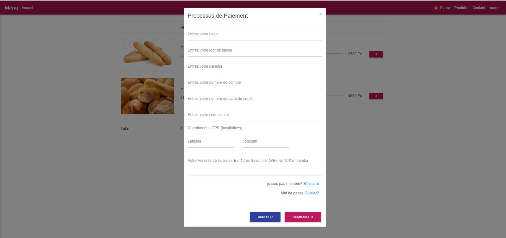

# INTRODUCTION 
   
Il  est  à noter qu’aujourd’hui, l’informatique est présente dans la plupart des domaines de la vie 
professionnelle et privée.   
   
  En effet,  la gestion  des  Boulangerie    est  une  tâche  capitale  qui  présente  un  nombre  important 
de  sous  tâches    réalisées    manuellement, mais, qu’avec le notion d’informatique on peut informatisé. 
Tâche  qui   consiste  généralement  à  répartir et  faire  les  suivie  de Livraison  des produit  à  domicile,   des 
gérer de manière centralisée les  diverses  commandes de client, permettre que les clients voie l’état de 
leur  commande  (Accepter,  état  de  cuisson,  ou  Livrée),    avoir  la  situation  réel  des  cuissons  de  produit 
pour chaque boulangerie, etc.  Qui sont des tâches essentielles effectué dans une boulangerie. 
 
  Dans  le  cadre  du  cours  de  Génie  Logiciel,  il  nous  a  été  demandé  de    réaliser  un  projet,  qui 
permettra de résoudre le problème suivant :  
# PROBLEMES  
Pour le projet susdit, il a été question de résoudre le problème identifié comme suite : 
Gérer  la livraison de Produit  à domicile, cas de la maison Zorobabel, qui pour ce faire, doit : 
-  Recruter de livreurs ou vacataire bien identifier possèdent  une motocyclette pour la livraison et 
un  IPhone    d’ôté  de  la  fonction  GPS  pour communique avec d’autres    livreurs    et  avoir tout  le 
détail de la livraison  
-  De gérer les commandes de client (Le gérant de Zorobabel   traite  directement  ces  commandes 
avec   le chef de chaque boulangerie, et doit avoir la situation réel   de commande effectuer et 
De Notifier le client l’état de de sa commande). 
-  Faire connaitre les produits aux clients pour chaque boulangerie selon ses propres spécialités  
 # SOLUTIONS   PRECONISEES 
 
 
 
 
 
 
 
 
